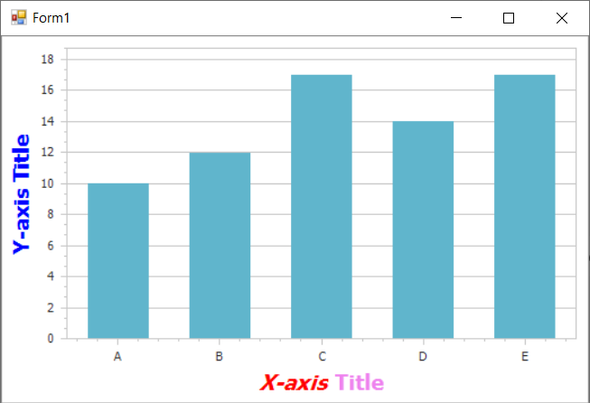

<!-- default badges list -->

<!-- default badges end -->

# Chart for WinForms -  How to Create and Customize an Axis Title

This example demonstrates how to access an [axis title](https://docs.devexpress.com/WindowsForms/5801/controls-and-libraries/chart-control/axes/axis-titles?p=netframework) at runtime.

Cast your [diagram](https://docs.devexpress.com/WindowsForms/DevExpress.XtraCharts.ChartControl.Diagram?p=netframework) object to the required diagram type, to access its [axes](https://docs.devexpress.com/WindowsForms/5779/controls-and-libraries/chart-control/diagram/axes). Then, you can access the [Title](https://docs.devexpress.com/CoreLibraries/DevExpress.XtraCharts.Axis2D.Title?p=netframework) property of an axis.

## Files to Review

* [Form1.cs](./CS/AxisTitle/Form1.cs) (VB: [Form1.vb](./VB/AxisTitle/Form1.vb))

## Documentation

[Axis Titles](https://docs.devexpress.com/WindowsForms/5801/controls-and-libraries/chart-control/axes/axis-titles)
